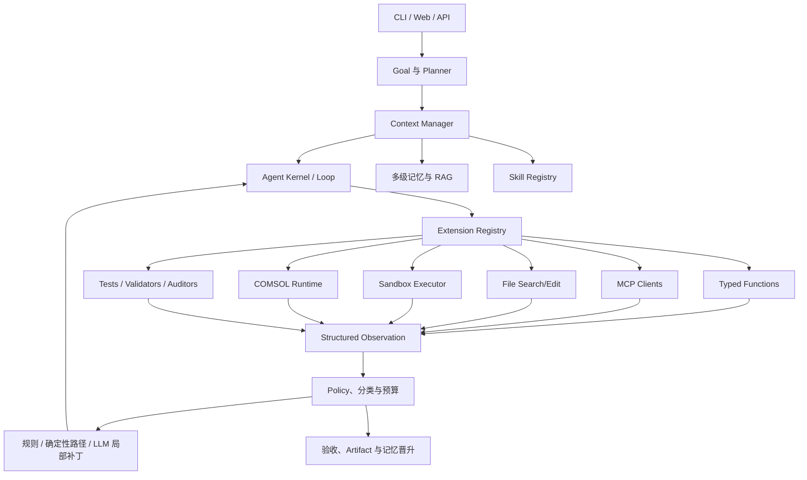
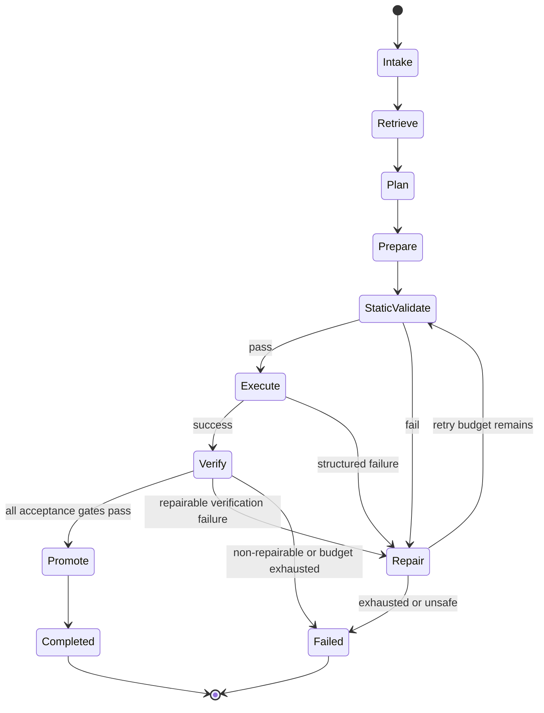

# COMSOL Agent V2 总体架构

## 1. 架构目标

V2 是一个面向工程仿真的可扩展 Code Agent。它需要理解用户需求，检索项目与历史经验，选择最小安全修改路径，编辑文件或模型代码，在受控环境中执行 COMSOL 和测试，根据真实反馈进行有限修复，并以可追溯的物理审计结果结束任务。

V2 不等同于“生成 COMSOL 代码的聊天机器人”。代码生成只是可选动作之一。

## 2. 架构不变量

1. Kernel 与具体轴承类型解耦。
2. 已支持需求优先走确定性路径；LLM 生成只处理未知或局部变化。
3. Function、MCP、Skill、Hook、规则、路径、Builder、Validator、Auditor 和 Memory Adapter 均通过统一扩展系统接入。
4. 文件、Shell 和 COMSOL 执行必须受权限、沙箱、超时和资源预算约束。
5. 每个外部动作返回结构化 Observation，并进入同一个 Agent Loop。
6. 静态检查、相似案例和 LLM 判断不等于运行正确。
7. COMSOL API 执行、求解收敛和物理审计是三个独立门槛。
8. 修复必须局部、可回滚、有限次并有复验器。
9. 记忆只能提供上下文；记忆的可信度由来源、版本和验证状态决定。
10. 所有关键状态转换、检索、工具调用、补丁和审计结果必须可追溯。

## 3. 系统分层



### 3.1 Agent Kernel

Kernel 只负责通用编排：

- Goal、Plan 和任务状态；
- 推理—动作—观察循环；
- 上下文预算和压缩；
- 扩展发现与调用；
- 权限、重试、时间和资源预算；
- 生命周期事件；
- Trace、取消、恢复和最终状态。

Kernel 不包含具体 COMSOL 标签、轴承几何公式或错误修复字符串。

### 3.2 Context Manager

Context Manager 组合：

- 当前 Goal 和 Plan；
- 用户需求与结构化规格；
- 工作区代码检索；
- 激活的 Skill；
- RAG 检索结果；
- 最近工具 Observation；
- 当前阶段检查点和预算；
- 项目规则与安全约束。

它必须保留来源标识，避免让模型把记忆、用户指令和运行事实混为一类。

### 3.3 Extension Registry

Registry 负责动态发现、校验、启停和隔离扩展。扩展协议见 [EXTENSION_SYSTEM.md](EXTENSION_SYSTEM.md)。Kernel 只能依赖扩展接口，不依赖具体实现。

### 3.4 Execution Environments

- Workspace：受控文件搜索和最小 diff 编辑；
- Sandbox：测试、格式化和辅助脚本执行；
- COMSOL Runtime：模型操作、求解和结果评估；
- External MCP：外部文档、服务或授权数据。

不同环境共享 Observation 协议，但权限和隔离策略独立。

## 4. 端到端状态机



阶段含义：

1. `Intake`：解析需求、单位、约束和输出目标；
2. `Retrieve`：检索代码、Skill、规则、成功案例和失败修复；
3. `Plan`：选择参数修改、Builder、文件补丁或未知拓扑路径；
4. `Prepare`：生成最小变更和执行计划；
5. `StaticValidate`：schema、依赖、类型、权限和领域约束检查；
6. `Execute`：在文件沙箱、测试沙箱或 COMSOL 中执行；
7. `Repair`：按错误类型局部修复并回滚；
8. `Verify`：运行测试、求解和物理审计；
9. `Promote`：保存 artifact，并按门槛写入可信记忆。

## 5. 主要数据合同

### 5.1 GoalSpec

- `objective`：可验证结果；
- `constraints`：权限、兼容、禁止项和预算；
- `acceptance`：测试和运行门槛；
- `status`：active、complete 或 blocked；
- `trace_id`：全链路标识。

### 5.2 EngineeringSpec

领域规格的通用封装：

- `domain` 与 `schema_version`；
- 用户显式值、派生值和默认值；
- 单位与来源；
- 拓扑、物理和求解签名；
- 约束验证结果；
- 与上一规格的 ChangeSet。

轴承领域通过 `BearingSpec` 扩展该合同，而不是改变 Kernel。

### 5.3 Action 与 Observation

Action 包含工具、参数、权限、幂等性和预期输出。Observation 至少包含：

- `success`、`status`、`stage`；
- 结构化数据和 artifact；
- `error_class`、异常类型、定位信息和可重试性；
- 执行耗时、资源使用和检查点；
- 来源扩展和版本。

### 5.4 RunManifest

RunManifest 记录需求、规格、检索、计划、代码哈希、工具调用、检查点、修复历史、测试、物理审计、版本和 artifact。它是调试、复现和记忆晋升的唯一事实索引。

## 6. 最小修改路由

按风险从低到高选择：

1. 参数或配置补丁；
2. 已验证确定性路径；
3. 确定性领域 Builder；
4. 受限模板补丁；
5. LLM 局部生成；
6. 新拓扑候选流程。

只有前一层无法表达需求时才能进入下一层。路由决策必须写入 RunManifest。

## 7. 建议代码边界

```text
comsol_agent/v2/
  kernel/          # goal、plan、loop、context、events、policy
  contracts/       # action、observation、manifest、errors
  extensions/      # registry、loader、manifest、lifecycle
  tools/           # file、shell、test 等内置函数工具
  mcp/             # MCP client 与 server adapters
  skills/          # skill discovery 与 activation
  memory/          # 多级记忆、RAG、晋升和失效
  runtime/         # execution orchestration、sandbox、locks
  repair/          # 分类、规则、路径和局部生成
  domains/         # bearing 等领域插件
  audit/           # 通用与领域审计协议
  web/             # V2 Web adapter 和事件
```

该结构是目标边界，不要求第一个提交一次性创建全部目录。每个里程碑只引入当前可验证的最小骨架。

## 8. 横切关注点

- 安全：最小权限、审批、可信扩展、网络限制；
- 并发：工作区隔离、COMSOL 模型锁、唯一运行目录；
- 可观测：结构化事件、Trace、阶段耗时和错误签名；
- 成本：LLM、COMSOL 核时、重试和检索预算；
- 版本：Git、合同、扩展、COMSOL 和记忆兼容矩阵；
- 人机协作：明确可暂停点、需要决策的条件和失败反馈。

## 9. 架构变更规则

以下变化必须新增或更新 ADR：

- Kernel 新增领域依赖；
- 扩展接口或 manifest 不兼容变化；
- 记忆晋升门槛变化；
- COMSOL 执行隔离或权限模型变化；
- 物理审计门槛降低；
- 新的持久化格式或兼容策略。

## 10. M1 实现映射

M1 的领域无关骨架位于 `comsol_agent/v2/`：

- `contracts/` 提供严格且可生成 JSON Schema 的 `GoalSpec`、`Plan`、`Action`、
  `Observation` 和 `RunManifest`；
- `kernel/state.py` 实现显式状态转换，失败和取消是独立终态；
- `kernel/context.py` 定义保留来源的 `ContextManager` 协议，并提供只组合 Goal、Plan、
  Observation 和预算的最小内存实现；
- `kernel/budget.py` 与 `kernel/cancellation.py` 在安全检查点约束动作、修复、时间和取消；
- `kernel/events.py` 提供有序事件总线与 append-only Trace；订阅者故障不会中断运行；
- `kernel/loop.py` 只依赖通用 `ToolExecutor` 协议，以结构化 Observation 驱动执行、验证、
  有界重试和终止，并把事实写入 RunManifest。

M1 的 `Repair` 只表示对 `retryable` Observation 的预算化重试。错误分类、动态修复规则、
rollback 和领域复验器仍分别属于 M2、M3 与 M6，不能通过在 Kernel 中增加条件分支实现。
运行因失败、预算耗尽或执行中取消进入终态时，当前 `in_progress` PlanStep 必须同步标记为
`failed`；已完成和尚未开始的步骤分别保持 `complete` 与 `pending`。

## 11. M2 实现映射

M2 在 `comsol_agent/v2/extensions/` 实现统一扩展合同、可信发现/加载、兼容与权限策略、Registry、
Resolver、Health 和租约式固定运行快照。Function 与 MCP Tool 通过 `RegistryToolExecutor` 实现 M1 的
`ToolExecutor` 协议，因此 Kernel 不导入扩展系统，也没有扩展 kind、能力 ID 或领域实现分支。

Manifest/配置校验发生在代码导入之前；激活、健康和调用故障被隔离到单个扩展；同能力最高候选
仍同分时产生结构化冲突。运行快照固定 active 扩展及版本；禁用对新解析立即生效，但已有快照
关闭前延迟 deactivation 并阻止卸载，因此不会改变正在执行的 Goal。信任、生命周期和解析决策见
[ADR 0002](adr/0002-extension-trust-lifecycle-and-resolution.md)。

## 12. M3 实现映射

M3 的领域无关 Code Agent 执行层位于 `comsol_agent/v2/tools/` 和
`comsol_agent/v2/runtime/`：

- `Workspace` 只接受工作区相对路径，拒绝 `..`、绝对路径和符号链接组件；搜索和 UTF-8
  分段读取有结果数、文件大小边界；`PatchSet` 只执行带期望次数的精确文本替换，歧义或陈旧
  上下文产生结构化冲突，不猜测修改位置；
- 文件修改采用临时文件原子替换。每个候选补丁和修复补丁之前建立受字节预算约束的文件检查点，
  执行失败、取消、同错重复或修复预算耗尽时按逆序 rollback；
- `ShellSandbox` 不调用 shell，只运行解析后 executable allowlist 与 argv profile 同时允许的命令，
  cwd 必须位于工作区，环境变量采用白名单，超时或取消会终止整个进程组；该策略是可信开发命令
  的策略沙箱；stdout/stderr 由固定块流式排空并共享保留字节预算，触顶立即终止进程组，避免把
  全部输出收入 Agent 内存；它不把同进程权限下的恶意程序误称为 OS/容器隔离；
- `TestRunner` 在沙箱中运行 pytest 和 Ruff。pytest 以 JUnit XML 产生测试节点、消息和定位信息，
  Ruff 使用 JSON 输出；超时、执行错误、测试/静态检查失败分别返回结构化 `Observation`；
- `CodeIterationLoop` 要求修复补丁引用触发它的 `Observation`，限制修复次数，以结构化失败指纹
  阻止同错循环，并在每次补丁后使用真实测试 runner 复验；修复策略通过
  `EvidenceRepairStrategy` 注入，执行层不包含轴承或 COMSOL 规则；
- `CodeToolExecutor` 以能力名到 handler 的映射实现 Kernel `ToolExecutor` 合同，文件、沙箱与测试
  失败无需在 Kernel 增加条件分支。更严格的外部隔离边界和 rollback 决策见
  [ADR 0003](adr/0003-workspace-sandbox-and-code-iteration-boundary.md)。

## 13. M4 实现映射

M4 在 `comsol_agent/v2/memory/` 实现领域无关的多级记忆、治理和混合检索。运行态 Working/Session
与长期 Episodic/Semantic/Procedural 严格分离；Artifact 只保留内容寻址引用。所有长期输入先进入
quarantine，VerifiedCase 与 RepairCase 分别通过严格审计证据和 runtime 复验晋升，Repository
本身拒绝直接写入 verified 或绕过治理改变状态。

混合 RAG 在 BM25、向量、关系和结构化分数融合前执行 domain、topology、版本、作用域、状态池、
错误签名和引用完整性硬过滤。兼容信息或引用复验缺失时，案例不能成为可执行基线；引用损坏会
进入 `needs_revalidation`。Context Pack 只传递有界接口/差异、角色、来源、可信度和 artifact 引用。
检索采用后的执行、物理审计和修复结果进入评估及后续重排，相似度本身不构成成功证据。持久化、
删除 tombstone、迁移 quarantine 和执行门禁见
[ADR 0004](adr/0004-memory-governance-persistence-and-retrieval.md)。
