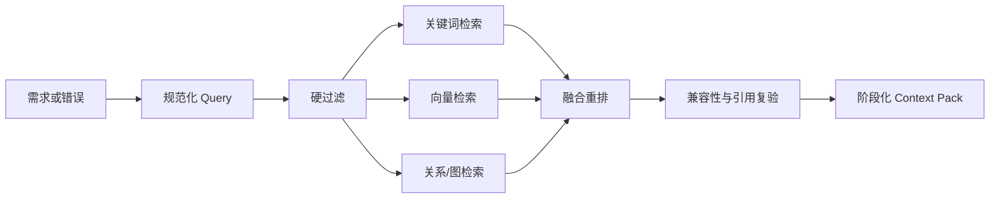

# V2 多级记忆与 RAG

## 1. 目标

记忆用于减少重复探索、复用经过验证的工程经验并支持错误修复。RAG 提高候选方案质量，但不替代代码执行、COMSOL 运行或物理审计。

## 2. 记忆层级

| 层级 | 内容 | 生命周期 |
|---|---|---|
| Working | 当前 Plan、Observation、错误、预算和检查点 | 单次运行 |
| Session | 多轮需求、参数覆盖和用户决策 | 当前会话 |
| Episodic | 成功、失败、修复和审计案例 | 长期 |
| Semantic | API 规则、物理规则、项目事实和架构决策 | 长期、版本化 |
| Procedural | Skill、确定性路径和修复流程 | 长期、可启停 |
| Artifact | 代码、模型、图片、数据和摘要 | 外部持久存储 |

Working/Session Memory 属于运行状态；Episodic/Semantic/Procedural Memory 才进入长期检索。

## 3. 记忆类型

- `verified_case`：严格审计通过的运行；
- `repair_case`：失败签名、诊断、补丁和复验；
- `api_rule`：在明确 COMSOL 版本验证的 API 规则；
- `project_fact`：仓库约束、命名和工作流事实；
- `candidate_case`：部分通过但未达到晋升门槛；
- `invalidated_case`：版本或证据失效的历史记录。

失败案例不能混入成功检索池，但可用于错误诊断。

## 4. 通用 MemoryRecord

```json
{
  "id": "mem_...",
  "type": "verified_case",
  "status": "verified",
  "summary": "12-roller cylindrical bearing, +X, 101 N",
  "content_ref": "artifact://run/.../manifest.json",
  "structured": {},
  "provenance": {
    "run_id": "...",
    "git_commit": "...",
    "code_hash": "...",
    "comsol_version": "...",
    "agent_schema": "..."
  },
  "compatibility": {},
  "quality": {},
  "citations": [],
  "created_at": "...",
  "validated_at": "..."
}
```

大文件不直接进入向量库，使用 `content_ref` 指向 artifact。

## 5. VerifiedCase

结构化字段至少包括：

- 原始需求和标准化需求；
- EngineeringSpec/BearingSpec；
- 拓扑、几何、物理和求解签名；
- 用户值、派生值、默认值及单位来源；
- 基线代码与分段哈希；
- 使用的扩展、规则和路径版本；
- COMSOL、Agent、合同和 Git 版本；
- API、选择集、网格、求解和物理门禁；
- 实际载荷、反力、接触力、稳定项比例和结果统计；
- MPH、PNG、JSON、CSV 和日志引用；
- 适用范围与失效条件。

## 6. RepairCase

```json
{
  "error_signature": {
    "class": "UNKNOWN_FEATURE",
    "exception": "FlException",
    "feature_pattern": "box_*",
    "stage": "selections"
  },
  "root_cause": "Intersection referenced a Box before creation",
  "failed_code_hash": "...",
  "patch_ref": "artifact://.../repair.diff",
  "repair_rule_id": "comsol.selection.create_before_use",
  "verification": {
    "static": true,
    "runtime": true,
    "physical": null
  }
}
```

只有复验成功的修复可以参与自动修复；未复验诊断只能作为低权重参考。

## 7. 索引

建议并行维护：

1. 结构化索引：领域、拓扑、版本、状态和质量；
2. 关键词/BM25：标签、异常、API 名称和精确术语；
3. 向量索引：标准化需求、摘要和修复语义；
4. 关系索引：案例—代码—扩展—错误—修复—artifact；
5. 哈希索引：代码、规格、模型和审计的精确复用。

## 8. 检索流程



硬过滤优先考虑：

- domain 和 topology signature；
- COMSOL 主版本；
- Agent/Builder/合同版本；
- verified/candidate/failure 池；
- 权限和数据作用域。

重排考虑：

- 拓扑精确度；
- 参数距离；
- 载荷、约束和求解相似度；
- 文本语义；
- 物理审计质量；
- 版本新鲜度；
- 历史采用后成功率。

权重应配置化并通过回归评估，而不是写死为不可修改常量。

## 9. Context Pack

不要将整份历史代码无条件塞入上下文。每次检索生成阶段化 Context Pack：

- 当前任务摘要和 ChangeSet；
- 一个主成功案例的接口/差异；
- 最多两个辅助案例；
- 当前阶段 API 规则；
- 当前错误对应的修复案例；
- artifact 引用和可信度；
- 明确标识“事实、案例、建议、运行 Observation”。

## 10. 晋升门槛

`verified_case` 必须满足 [TEST_AND_ACCEPTANCE.md](TEST_AND_ACCEPTANCE.md) 的严格门禁，包括：

- 全阶段可执行；
- 选择集和接触绑定正确；
- 返回目标载荷步；
- 载荷、反力和接触力平衡；
- 数值稳定项受控；
- 应力/位移有限；
- 原生结果和 MPH 可用；
- provenance 完整。

LLM 不得自行宣布案例 verified；晋升由 Auditor 和 Promotion Policy 决定。

## 11. 失效与复验

以下变化触发 `needs_revalidation`：

- COMSOL 主版本变化；
- Builder、Extension API 或物理合同不兼容升级；
- 引用代码哈希不匹配；
- 审计门槛提高；
- artifact 丢失或损坏；
- 关键来源被撤销。

使用前重新验证引用和兼容性。失效案例仍可用于历史分析，但不能作为可执行基线。

## 12. 写入、防污染和治理

- Working Observation 默认不进入长期记忆；
- 候选内容先进入 quarantine/candidate；
- 自动生成的 project fact 必须带代码引用；
- 用户可以查看、禁用、删除和重新验证记忆；
- 敏感路径、密钥和个人信息不得进入 embedding；
- 同一失败不得无限生成重复 repair case；
- 定期压缩重复案例，但保留 provenance 链。

## 13. 评估指标

- Top-k 检索命中率；
- 检索案例实际采用率；
- 使用检索后的首次建模成功率；
- repair case 命中后的修复成功率；
- 错误拓扑复用率，目标为 0；
- 失效案例拦截率；
- 记忆污染和重复率；
- 检索延迟与上下文 token 成本。

必须以执行和审计结果评估检索质量，不能只使用文本相似度指标。

## 14. M4 实现映射

M4 的领域无关实现位于 `comsol_agent/v2/memory/`：

- `contracts.py` 定义严格且可生成 JSON Schema 的 MemoryRecord、VerifiedCase、RepairCase、
  provenance、兼容、质量、检索、Context Pack 和执行结果合同；Working/Session 使用独立的
  RuntimeMemoryEntry，不能伪装为长期 MemoryRecord；
- `store.py` 提供运行态 Working/Session 存储、带结构化/哈希/关系索引的参考 Repository，以及
  原子写入的 `1.0` JSON 快照后端。新长期记录只能以 quarantined 状态写入，删除移除内容并保留
  无内容 tombstone；
- `governance.py` 实现 quarantine、candidate、active/verified、needs_revalidation、invalidated 和
  删除。VerifiedCase 与 RepairCase 使用不同晋升证据，Repository 拒绝绕过治理的状态变更；
- `retrieval.py` 在融合结构化、BM25、向量和关系分数前执行 domain、topology、状态、版本、作用域、
  错误签名和 artifact 引用硬检查。向量器和权重均可注入；默认 hashing vectorizer 只作为离线、
  确定性的参考实现；
- `context.py` 只组合一个主成功案例、最多两个辅助案例、当前 API rule、一个相符 RepairCase 和
  Observation，保留角色、来源、可信度和 artifact 引用，不复制历史完整代码；
- `evaluation.py` 以采用后的首次执行、物理审计和修复结果统计质量，并把采用成功/失败回写案例，
  供后续重排使用；
- `migration.py` 和 `scripts/migrate_v2_memory.py` 从既有 V2 RunManifest 回填 quarantined
  candidate_case。迁移不推断严格审计，也不自动晋升。

持久化、删除、硬过滤和执行门禁决策见
[ADR 0004](adr/0004-memory-governance-persistence-and-retrieval.md)。

## 15. 迁移说明

从已有 RunManifest 回填到新的本地 JSON Memory Adapter：

```bash
.venv/bin/python scripts/migrate_v2_memory.py \
  --store .v2-memory/memory.json \
  --agent-version 2.0.0 \
  path/to/run-manifest.json [path/to/another-manifest.json ...]
```

迁移行为是保守且幂等的：

- 输入必须包含 `run_id`、Goal、运行状态、版本和 artifact 列表；不完整输入进入 skipped 报告；
- 相同 `content_ref` 不重复导入；
- 所有导入项均为 quarantined `candidate_case`，旧状态 `completed` 或旧 `audits.passed` 不能替代
  当前严格审计；
- 操作者需先补齐结构化 VerifiedCase/RepairCase、当前兼容范围、引用哈希和 provenance，再通过
  `MemoryGovernance.nominate()` 与对应 promotion 方法晋升；
- 旧的 `comsol_agent/memory/` 会话归档不自动迁移为长期可信案例。它缺少 M4 所需的运行、物理审计
  和兼容证据，只能作为人工迁移输入；
- 删除后的 ID 有 tombstone，不能通过重复迁移恢复。若确需恢复，必须建立新记录 ID 和新的
  provenance 链，并重新经过 quarantine 与审计。
