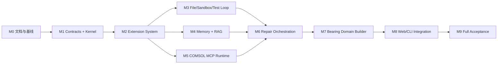

# V2 开发路线图

## 1. 路线图原则

- 先建立通用 Kernel 和扩展合同，再接入领域实现；
- 每个里程碑都必须可独立测试和提交；
- 不为了展示进度提前绕过运行或物理门禁；
- 路线图调整不能未经 ADR 改变架构不变量；
- `/goal` 默认一次只推进一个里程碑。

## 2. 依赖关系

## M0：文档、决策与开发基线

目标：冻结可执行的架构合同和开发方式。

交付物：

- `docs/v2/` 文档集；
- 根目录 `AGENTS.md`；
- ADR 模板和首个架构 ADR；
- 明确工作树基线和提交边界；
- Goal 开发手册。

验收：文档链接、职责和优先级一致；后续 Goal 可明确引用。

## M1：Contracts 与 Agent Kernel

目标：实现领域无关的最小 Agent Loop。

状态：`complete`（2026-08-20）。

交付物：

- GoalSpec、Plan、Action、Observation、RunManifest；
- 状态机、预算、取消、Trace 和事件总线；
- Context Manager 接口；
- fake tool 驱动的执行循环。

验收：使用 fake tools 完成一次成功、一次可修复失败和一次预算耗尽流程。

完成记录：

- 实现：`comsol_agent/v2/contracts/`、`comsol_agent/v2/kernel/`；
- 测试：M1 定向 12 passed；完整非 COMSOL 套件 242 passed；
- Ruff：M1 修改范围通过；全仓仍有 3135 个既有问题，未混入本里程碑；
- COMSOL gate：不适用，M1 的验收环境是 fake tools；
- ADR：沿用 Accepted 的 ADR 0001，无架构不变量变化；
- commit：`80689ab6c1181d7dfd62d08882372bb21fac1729`；
- 未解决风险：M2 尚未提供动态扩展 Registry；M1 `ToolExecutor` 是其稳定执行边界；
- M2 输入：已版本化合同、状态机、Context Manager、预算/取消、事件/Trace 和 fake-tool
  Agent Loop。

## M2：动态扩展系统

目标：使能力可发现、验证、启停和隔离。

状态：`complete`（2026-08-20）。

交付物：

- Extension manifest/schema；
- Registry、Loader、Resolver 和 Health；
- Function、MCP、Skill、Hook 接口；
- Repair Rule、Deterministic Path、Builder、Validator 和 Auditor 接口；
- 冲突和权限模型。

验收：注册/禁用/删除无需编辑 Kernel；冲突和异常扩展不静默覆盖或拖垮主循环。

完成记录：

- 实现：`comsol_agent/v2/extensions/`，通过固定快照和 `RegistryToolExecutor` 接入 M1 Kernel
  合同，Kernel 没有导入具体扩展；
- 测试：M1+M2 定向 41 passed；完整非 COMSOL 套件 271 passed；
- Ruff：M2 修改范围通过；全仓旧代码问题未混入本里程碑；
- COMSOL gate：不适用，M2 使用 fake extension 验证合同、生命周期和隔离；
- ADR：新增 Accepted 的 ADR 0002；
- commit：`260f0876cb3c199880778223a26d94938478cb36`；
- 未解决风险：Python entrypoint 是可信进程内代码而非进程级沙箱；隐式能力依赖必须由扩展作者
  转为显式 dependency；
- M3 输入：版本化 Manifest、可信 Loader、权限/兼容策略、动态 Registry、固定快照、结构化
  Resolver/Health 和 Kernel ToolExecutor 适配器。

## M3：文件编辑、沙箱执行与测试迭代

目标：形成通用 Code Agent 闭环。

状态：`complete`（2026-08-20）。

交付物：

- 文件搜索、读取和最小补丁；
- workspace 写边界；
- Shell Sandbox、超时和取消；
- pytest/ruff runner；
- 测试失败 Observation 和有限修复循环；
- 文件检查点或 diff rollback。

验收：Agent 能在 fixture 仓库中修改一个缺陷，运行测试，根据失败修复并通过验收。

完成记录：

- 实现：`comsol_agent/v2/tools/` 提供受约束 Workspace、Shell Sandbox、pytest/Ruff runner 与
  `CodeToolExecutor`；`comsol_agent/v2/runtime/` 提供引用 Observation、限制次数、同错停止和
  checkpoint rollback 的通用代码迭代 loop；
- 独立 fixture：`tests/fixtures/m3_code_repo/` 在临时副本中完成搜索/读取、第一次 exact patch、
  真实 pytest 失败、依据结构化失败的第二次 patch 及复验通过，不依赖轴承或 COMSOL 规则；
- 测试：M3 定向 14 passed；M1–M3 联合 55 passed；完整非 COMSOL 套件 285 passed，1 个既有
  Starlette/httpx 弃用 warning；
- Ruff：`comsol_agent/v2` 与 M1–M3 测试范围通过；全仓仍有 3136 个 M3 之前或当前无关用户
  工作树中的旧问题，未在本里程碑批量改写；
- COMSOL gate：不适用，M3 验收对象为领域无关的文件、可信开发命令和测试闭环；未发生
  verified memory 晋升；
- ADR：新增 Accepted 的 ADR 0003，明确路径/补丁/回滚合同、executable + argv profile、
  timeout/cancellation，以及策略沙箱不等于恶意代码 OS 隔离；
- commits：实现 `477e2102d950b9e4ea3d4bfac87c0e092dbbb9d9`；领域中立守卫
  `2fe8e1789bc366b7cc37ee9effad08ffbc8a8619`；流式输出资源边界修复
  `3d53a65015de7e15e53135948a6622f60a7bc190`；
- 未解决风险：checkpoint 只支持单进程内恢复；获准命令仍使用宿主用户权限，不可用于恶意代码；
- M6 输入：结构化 pytest/Ruff Observation、证据绑定的局部补丁合同、失败指纹、修复预算和
  文件 rollback；M4/M5 可继续按既有依赖关系独立推进。

## M4：多级记忆与 RAG

目标：提供可信、版本化和可评估的上下文检索。

状态：`complete`（2026-08-21）。

交付物：

- Working/Session/Episodic/Semantic/Procedural/Artifact Memory；
- MemoryRecord、VerifiedCase、RepairCase；
- 结构化、关键词、向量和关系检索；
- Context Pack；
- 晋升、quarantine、失效和删除；
- 从现有 artifact 回填的迁移工具。

验收：兼容成功案例被命中，不兼容拓扑和失效版本被拒绝，修复案例只能在相符错误下使用。

完成记录：

- 实现：`comsol_agent/v2/memory/` 提供严格合同、运行态与长期层级、原子 JSON 参考后端、治理
  状态机、结构化/BM25/向量/关系/哈希索引与检索、引用复验、Context Pack、执行结果评估和
  RunManifest quarantine 迁移工具；
- 安全门禁：Repository 拒绝直接新增非 quarantine 记录和绕过治理的状态转换；VerifiedCase 只有
  最终规格、全阶段、目标步、严格物理门禁、完整 artifact/provenance 与匹配 Auditor 同时通过才
  可执行；RepairCase 只有相符错误签名且 static/runtime 复验有来源时可自动使用；
- 测试：M4 定向 17 passed；M1–M4 联合 72 passed；完整非 COMSOL 套件 302 passed，1 个既有
  Starlette/httpx 弃用 warning；
- Ruff：M4 修改范围通过；全仓 `--statistics` 仍为 3136 个 M3 已记录的旧问题，M4 未新增问题；
- COMSOL gate：不适用。M4 验收使用受控案例、引用 catalog 和执行结果合同验证记忆/RAG 策略，
  本里程碑没有把 fixture 或历史 artifact 晋升到持久 verified memory；
- ADR：新增 Accepted 的 ADR 0004，固化 quarantine-first、持久化/删除、硬过滤、引用复验和执行
  结果评估策略；
- commit：`99b38d662b574c61aee71bc3bc7b8431af0077da`；
- 未解决风险：参考 JSON 后端不提供多进程事务或恶意篡改防护；默认 hashing vectorizer 用于离线
  确定性基线，生产 embedding/数据库/图后端需通过 Memory Adapter 注入且不得绕过硬门禁；
- M6 输入：带 provenance 的 Context Pack、严格相符且 runtime 复验的 RepairCase、采用后执行/
  审计指标、失效拦截和可配置混合重排。

## M5：COMSOL MCP Runtime

目标：将 COMSOL 封装为受控、结构化、可恢复的执行环境。

状态：`complete`（2026-08-21）。

交付物：

- COMSOL MCP Server 或等价受控工具服务；
- 模型生命周期、锁、超时、取消和资源预算；
- A-D 阶段接口；
- 检查点和兼容性校验；
- 异常结构化；
- artifact 管理。

验收：已知 API 错误完整上浮；C 阶段失败可从 B 检查点恢复；取消后释放资源。

完成记录：

- 实现：`comsol_agent/v2/runtime/comsol/` 提供严格合同、单客户端会话、唯一物理名、模型锁、资源
  租约、A-D 编排、B 检查点恢复、ArtifactStore、原因链分类、`MphBackendAdapter`、可替换
  `BackendWorker` 和 17 个最小 MCP Tool extensions；
- 本地复用：直接复用 V1 `COMSOLClient`/`ModelHandle` 与底层 MPh 操作，不调用会吞掉原因链的
  dict wrappers，不注册任意 Java/Python/Shell；外部项目只作固定 commit/许可证设计参考；
- 测试：M5 定向 15 passed；M1–M5 联合 87 passed；完整套件 317 passed，1 个既有
  Starlette/httpx 弃用 warning；core 203、bearing domain 14、web 13 passed；
- Ruff：M5、`comsol_agent/v2` 和相关测试/脚本范围通过；全仓命令仍报告与 M4 基线相同的 3136
  个既有旧代码/当前无关用户工作树问题，M5 没有新增；
- COMSOL gate：本机 MPh 1.3.1 + COMSOL 6.2 lifecycle smoke 通过 start/create/save/close/stop，
  隔离 `.mph` 为 19,952 bytes 且记录 SHA-256；M5 不以此冒充领域求解或严格物理审计；
- P0 加固：公开 MCP 操作端到端复用 Kernel cancellation token；restore 使用分离的
  parameters/specification 验证并真实加载 `.mph`；Builder/Path handler 绑定固定快照中
  的扩展对象，并校验 ID/version/kind/capability；
- ADR：新增 Accepted 的 ADR 0005；补齐 `TOOLS_MCP_SKILLS.md` 和第三方来源/许可证记录；
- 未解决风险：进程内 MPh 阻塞调用不能可靠硬取消，未确认终止会 quarantine；需要强终止或并行
  会话的部署必须实现可回收进程 worker 并受许可证/核心预算控制；
- M6 输入：稳定错误类/具体 code 与完整 cause chain、兼容 B checkpoint、受控 Builder/Path 执行、
  明确 termination confirmation、失败索引和 artifact provenance。

## M6：诊断、规则与修复编排

目标：把测试和 COMSOL 错误转为局部、有限、可验证修复。

状态：`complete`（2026-08-21）。

交付物：

- 错误分类器；
- Repair Rule 和 Solver Strategy 注册；
- 确定性修复优先级；
- RepairCase 检索；
- LLM 最小补丁合同；
- 同错停止、重试预算和 rollback。

验收：创建顺序、无效属性、实体维度和测试失败可自动修复；不收敛不会触发全模型重写。

实现记录：

- `comsol_agent/v2/repair/` 已实现严格 Diagnosis、动态 Repair Rule/Solver Strategy、固定优先级、
  M3 exact patch/checkpoint、M4 governed RepairCase、有限预算、同错停止、verifier、rollback、Trace
  与 RunManifest 记录；
- M5 残余加固已实现同步 handler 线程边界、锁/租约等待取消与 deadline，以及重复 `run_id` 的
  单 owner 结构化拒绝；
- ADR：新增 Accepted 的 ADR 0006；
- 测试：M6 定向 17 passed；M1–M6 联合 108 passed；完整套件 338 passed，1 个既有 warning；
  core 203、bearing domain 14、web 13 passed；
- Ruff：M6 修改范围通过；包含整个历史 `scripts` 的附件命令仍有 1607 个既有问题，未改写无关
  旧脚本；
- COMSOL gate：真实 MPh 1.3.1 + COMSOL 6.2 的 `INVALID_PROPERTY`—B checkpoint 恢复—确定性
  属性修复—API 复验通过；不声明 solve/物理审计成功；
- 未解决风险：进程内线程无法硬杀阻塞 Java，生产强制终止仍需可回收进程 Worker；
- M7 输入：稳定 Diagnosis/RepairCandidate/RepairResult、Repair Rule/Solver Strategy 合同、固定
  候选排序、受控 executor、严格 RepairCase adapter、RunManifest/Trace 和已加固 Runtime；
- commit：M6 独立提交（以本里程碑最终 `git log` 为准）。

M7 前 P0 加固（2026-08-21）：

- Repair Rule/Solver Strategy 的 preconditions、合同级 Agent/COMSOL/Builder 兼容、尝试/solve/核时
  预算、成功判据和 rollback checkpoint 已由编排器执行，不再只是 manifest 声明；
- 验收门禁改为 Policy/Goal 最低要求与候选附加要求的并集，空 gates 被合同拒绝，RepairCase
  强制 static/runtime gates；M7 可注入不可降低的 solve/audit gates；
- checkpoint 创建、commit、rollback 二级失败均返回结构化安全终态；rollback 未确认时设置
  `manual_recovery_required` 并停止后续修复；
- `RepairExecutor.apply` 接收类型化剩余预算与门禁；固定扩展快照携带已验证运行版本；
- 测试：M6 定向 25、M1–M6 联合 116、完整 346、core 203、bearing 14、web 13 passed；修改范围
  Ruff 通过；真实 MPh 1.3.1 + COMSOL 6.2 API repair smoke 再次通过，未运行 solve/audit；
- 架构决策记录于 Accepted ADR 0007；提交证据以本 follow-up 最终记录为准。

## M7：轴承领域插件与确定性 Builder

目标：在通用架构上实现当前支持的轴承需求。

状态：`complete`（2026-08-23 重新严格验收）。

交付物：

- BearingSpec 和 ChangeSet；
- 参数覆盖路径；
- 圆柱滚子轴承 A-D Builder；
- 几何、选择、接触和物理 Auditor；
- 动态载荷延续；
- 轴承 Skill 和 deterministic paths。

验收：同拓扑载荷修改不调用全量 LLM；尺寸、数量、相位和方向在支持范围内由 Builder 完成。

完成记录：

- `comsol_agent/v2/domains/bearing/` 实现严格 `BearingSpec`、含显式径向游隙的几何约束、
  `BearingChangeSet` 和最小路由；载荷/方向/solver 走参数路径，尺寸/游隙/数量/相位走确定性重建，
  全部 `requires_llm=false`；
- 8 个 manifest 可发现并动态注册 Builder、4 类 Auditor、2 条 deterministic path 和 Skill；禁用/
  卸载不修改 Kernel，Skill 不授予权限；
- A–D Builder 复用经审查 V1 资产，动态延续保留 B rollback checkpoint 和目标步/solve/audit
  成功判据；Kernel 领域中立守卫通过；
- `tests/test_v2_bearing_domain.py` 33 passed；V2 M1–M7 联合 149 passed；完整非 COMSOL 套件
  379 passed，1 个既有弃用 warning；M7 新增模块和 gate 脚本 Ruff 通过；
- 真实 COMSOL 6.2 gate 使用唯一新模型运行 10 滚子、改尺寸、1.5 mm 总径向游隙、7.5°、+X、
  1 N 案例，约 768 秒完成。目标步、实际载荷、支承反力、外接触合力、稳定项、方向、有限结果、
  原生 PNG 和 solved MPH 全部门禁通过；外接触合力相对误差约 0.647%，稳定力占比约
  `7.88e-6`；
- 重新严格验收证据位于 `reports/v2_m7_bearing_evidence/20260823T203213-c9c9b297/`，V2 Builder 代码、
  configured/solved MPH、PNG、摘要和 checkpoint 均有 SHA-256；失败的首次规格尝试也独立保留，
  未用历史 artifact 冒充；
- 内嵌审阅资产 SHA-256 为 `3f8e0d241a4e078f365c90497e6dc3db9be0e78be909b036bfafee684b572062`；
  当前确定性 Builder 输出 SHA-256 为 `a2f95a8b067de9a8c67abf2d44119c21c72169b84ed7c0cc63f13eae5415c77d`，
  与真实 gate 输入逐字节一致；
- 目标结果显式绑定 `dset7` / solution 1 / `radial_load=1 N`：`solid.mises/1[Pa]`
  为 `89433.33087249525 Pa`，`solid.disp/1[m]` 为 `3.0172418316622154e-7 m`；原生图
  使用同一 dataset/solution，其 numerical maximum 一致；
- `solver_relative_tolerance` 经真实 COMSOL 确认映射 Stationary `stol`，`sol1`–`sol7`
  全部写入并读回 `0.001`；旧报告的 `6.2959e-6 Pa` 取数与原生图矛盾，已废弃为
  无效应力证据；
- 未发生 verified memory 晋升。-X/±Y 虽可确定性生成和配置，但在新的相同严格真实 gate 通过前
  仍是 candidate，不宣称为 verified；
- 未改变 Kernel、扩展接口、运行隔离或审计阈值，不需要新增 ADR。M8 可从稳定的领域合同、动态
  能力和真实 A–D evidence 接入 Web/CLI。

## M7.5：真实 LLM Gateway、Intake 与 Planner

目标：在不污染领域中立 Kernel 的前提下，让自然语言需求经真实 LLM 转为可复验的
类型化规格和受控计划。

状态：`complete`（2026-08-24 M7.5.1 重新验收）。2026-08-23 的旁路证据不再计为
Agent E2E；新证据已证明 Planner Plan 经 Agent Kernel、固定 Registry snapshot、领域
Workflow、M5 Runtime、确定性 Builder 和严格 Auditor 完整执行。

交付物：

- provider-neutral `ModelRequest/Response/Error/Usage/StructuredOutput` 和 fake/replay/
  OpenAI-compatible adapter；
- 中文单轮/多轮 Bearing Intake，显式/继承/默认/派生 provenance，澄清、冲突与
  unsupported 停止；
- Goal/ChangeSet/Registry/预算/ContextPack 驱动的 Planner 和 Policy 复验；
- M6 `CandidateProvider` 边界内的 exact local `PatchSet`；
- Prompt/schema 版本、脱敏 Trace、真实 LLM smoke 和 LLM+COMSOL E2E gate；
- Accepted [ADR 0008](adr/0008-controlled-model-gateway-and-llm-planning.md)。

验收记录（原 M7.5 子系统验收）：

- `tests/test_v2_model_gateway.py` 覆盖 fake/replay、schema/取消、中文完整规格、多轮载荷/方向
  继承、缺参澄清、冲突/不支持拒绝、RAG 引用、route/capability 注入拒绝和受限局部修复；
- M7.5 定向 13 passed，M1–M7.5 联合 162 passed，完整非 COMSOL 套件 392 passed，
  1 个既有 Starlette/httpx warning；修改范围 Ruff 通过；
- 真实 DeepSeek `deepseek-v4-pro` smoke 通过：Intake 1769 tokens，Planner 1210 tokens，
  保存 Prompt/schema 版本、request id、digest、UTC 时间和脱敏 Trace；
- 真实 E2E 使用另一次 DeepSeek 调用（Intake 1769 + Planner 1198 = 2967 tokens），
  将中文需求解析为已验证 `BearingSpec`，Policy 选择 deterministic rebuild，保留
  `m7-real-gate-20260823` RAG 引用，`llm_full_model_rewrite=false`；
- E2E 新建 COMSOL 6.2 模型并在约 778 秒后通过严格审计；数值与 M7 重跑一致，
  solved MPH SHA-256 为 `ab6207070a6f82ee2005b85184fba47891bbf4bfc03456cb13a2f7823982e6ae`；
- 完整证据位于 `reports/v2_m7_5_llm_evidence/20260823T210207-dceed0e9/`，仅脱敏摘要进入 Git；
  API key 未记录，未发生 verified memory 晋升。

M7.5.1 补验记录：

- Planner 现从真实 `ExtensionSnapshot` 构造 capability catalog，生成固定 Function/Builder/
  Path/Auditor 版本的 Action；`bearing.workflow.execute` 由 Kernel 经 Registry 执行，再进入
  M5 Runtime，不再 subprocess 旁路旧 gate；
- +X/1 N 无 checkpoint 真实 Kernel E2E 通过：DeepSeek 用量 3758 tokens，A/B/C/D
  全部 passed，四类 Auditor 通过，
  stress 数值与原生图 numerical maximum 均为 `89433.38638405208 Pa`，同为
  `dset7` / solution 1，`stol=0.001` 读回通过；
- -Y/10 N 真实多轮覆盖正确路由为 `parameter_override` 并跳过 A/B，证明没有
  整模型 LLM 重写或几何重建；但 C solve 在 1200 s 超时，所以该签名仍未验证；
- 紧凑证据位于 `docs/v2/evidence/m7-5-1-kernel-e2e-20260824.json`；完整成功/失败 artifact
  保留在各自隔离的 `reports/v2_m7_5_llm_evidence/` 运行目录；
- M7.5.1 完成条件已满足，M8 可开始。这不扩大轴承 verified parameter envelope：
  -Y/10 N 仍是超时 candidate；进程内 MPh 硬取消和更多参数签名的真实门禁作为
  M8/M9 明示风险和扩展工作保留。

## M8：Web、CLI 与可观测性

目标：向用户提供真实、可干预的 Agent 运行体验。

状态：`complete`（2026-08-25）。

交付物：

- V2 Web/CLI adapter；
- 阶段、检索、工具、修复、预算和审计事件；
- 暂停、取消、恢复和失败反馈；
- artifact 下载；
- 多轮规格变化。

验收：界面不混淆静态、建模、求解和审计状态；失败能显示分类、证据和已执行修复。

完成记录：

- `comsol_agent/v2/web/` 提供 Web/CLI 共用的严格事件、四 Gate 投影、会话控制、artifact 下载、
  多轮规格/checkpoint 和真实轴承 driver；`ComsolRuntime` 可选 stage sink 实时发送 A-D；
- 旧 `/api/chat`、demo/live/strict preview、`comsol-agent` 保持兼容；新增 V2 API、页面模式与
  `comsol-agent-v2`，静态回放不写 V2 运行 Gate；
- M8/API/Runtime/CLI 定向测试通过；完整非 COMSOL 套件 409 passed，1 个既有 warning；修改范围
  Ruff 和前端 JavaScript 语法通过；
- 全仓 Ruff 仍有 3138 个历史/当前无关工作树问题；M8 修改范围通过，未混入批量清理；
- 真实 DeepSeek + Kernel + Registry + COMSOL 6.2 + strict Auditor 新案例在 1800 秒预算内完成，
  A-D 和四类 Auditor passed，1 action、0 repair、约 1328.7 秒；本次 solved MPH/PNG/CSV/
  checkpoint 有 SHA-256；证据见 `docs/v2/evidence/m8-web-cli-e2e-20260825.json`；
- 1200 秒总预算运行即使 A-D 已执行通过仍被正确判为失败；family alias 与外部连接失败也没有被
  混入成功。未发生 verified memory 晋升；
- 未改变架构不变量，无新增 ADR。剩余风险是进程内 MPh 对阻塞 Java 调用不能保证硬取消；Web/
  CLI 明确显示 `termination_confirmed`，生产强取消仍需可回收进程 Worker；
- 真实 gate 驱动 `V2SessionManager`→Agent→COMSOL，HTTP/SSE 功能测试使用 fake driver；
  因此不将它记录为真实浏览器组合 E2E。会话/事件是内存态，服务重启恢复不属于 M8；
- M9 输入：真实可重放 M8 事件证据、独立 Gate、交互控制、下载和多轮路径。

## M9：全量验收与扩展准备

目标：完成 [TEST_AND_ACCEPTANCE.md](TEST_AND_ACCEPTANCE.md) 中的最终门槛。

交付物：

- 完整非 COMSOL 测试；
- 核心本地 COMSOL 回归；
- 物理审计报告；
- 性能、成本和可靠性指标；
- 新轴承族插件指南；
- 发布和回滚说明。
- 真实浏览器或真实 HTTP client→HTTP→SSE→Agent smoke gate；
- 会话/事件持久化与服务重启恢复策略；
- 生产级可回收独立进程 Worker 及阻塞 COMSOL 强取消验证。

验收：最终 Definition of Done 全部满足，包括普通回归不调用外部 LLM、真实 LLM gate
显式 opt-in、Prompt/schema/provider/model/usage/Trace 可追溯、LLM 输出不能越过 Policy/
Registry/COMSOL/Auditor，且至少一条自然语言到严格物理审计的真实 E2E 可重放。

## 3. 状态维护

每个里程碑使用以下状态：`not_started`、`in_progress`、`blocked`、`complete`。完成时记录：

- commit；
- 测试命令与结果；
- COMSOL gate；
- ADR；
- 未解决风险；
- 下一里程碑输入。

路线图只记录可验证状态，不以代码行数或文件数量表示完成度。
