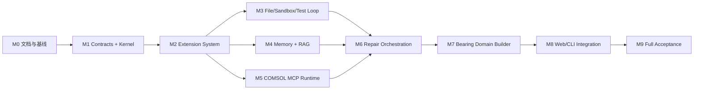

# V2 开发路线图

## 1. 路线图原则

- 先建立通用 Kernel 和扩展合同，再接入领域实现；
- 每个里程碑都必须可独立测试和提交；
- 不为了展示进度提前绕过运行或物理门禁；
- 路线图调整不能未经 ADR 改变架构不变量；
- `/goal` 默认一次只推进一个里程碑。

## 2. 依赖关系

## M0：文档、决策与开发基线

目标：冻结可执行的架构合同和开发方式。

交付物：

- `docs/v2/` 文档集；
- 根目录 `AGENTS.md`；
- ADR 模板和首个架构 ADR；
- 明确工作树基线和提交边界；
- Goal 开发手册。

验收：文档链接、职责和优先级一致；后续 Goal 可明确引用。

## M1：Contracts 与 Agent Kernel

目标：实现领域无关的最小 Agent Loop。

状态：`complete`（2026-08-20）。

交付物：

- GoalSpec、Plan、Action、Observation、RunManifest；
- 状态机、预算、取消、Trace 和事件总线；
- Context Manager 接口；
- fake tool 驱动的执行循环。

验收：使用 fake tools 完成一次成功、一次可修复失败和一次预算耗尽流程。

完成记录：

- 实现：`comsol_agent/v2/contracts/`、`comsol_agent/v2/kernel/`；
- 测试：M1 定向 12 passed；完整非 COMSOL 套件 242 passed；
- Ruff：M1 修改范围通过；全仓仍有 3135 个既有问题，未混入本里程碑；
- COMSOL gate：不适用，M1 的验收环境是 fake tools；
- ADR：沿用 Accepted 的 ADR 0001，无架构不变量变化；
- commit：`80689ab6c1181d7dfd62d08882372bb21fac1729`；
- 未解决风险：M2 尚未提供动态扩展 Registry；M1 `ToolExecutor` 是其稳定执行边界；
- M2 输入：已版本化合同、状态机、Context Manager、预算/取消、事件/Trace 和 fake-tool
  Agent Loop。

## M2：动态扩展系统

目标：使能力可发现、验证、启停和隔离。

状态：`complete`（2026-08-20）。

交付物：

- Extension manifest/schema；
- Registry、Loader、Resolver 和 Health；
- Function、MCP、Skill、Hook 接口；
- Repair Rule、Deterministic Path、Builder、Validator 和 Auditor 接口；
- 冲突和权限模型。

验收：注册/禁用/删除无需编辑 Kernel；冲突和异常扩展不静默覆盖或拖垮主循环。

完成记录：

- 实现：`comsol_agent/v2/extensions/`，通过固定快照和 `RegistryToolExecutor` 接入 M1 Kernel
  合同，Kernel 没有导入具体扩展；
- 测试：M1+M2 定向 41 passed；完整非 COMSOL 套件 271 passed；
- Ruff：M2 修改范围通过；全仓旧代码问题未混入本里程碑；
- COMSOL gate：不适用，M2 使用 fake extension 验证合同、生命周期和隔离；
- ADR：新增 Accepted 的 ADR 0002；
- commit：未创建（保留为当前 Goal 的可审查工作树变更）；
- 未解决风险：Python entrypoint 是可信进程内代码而非进程级沙箱；隐式能力依赖必须由扩展作者
  转为显式 dependency；
- M3 输入：版本化 Manifest、可信 Loader、权限/兼容策略、动态 Registry、固定快照、结构化
  Resolver/Health 和 Kernel ToolExecutor 适配器。

## M3：文件编辑、沙箱执行与测试迭代

目标：形成通用 Code Agent 闭环。

交付物：

- 文件搜索、读取和最小补丁；
- workspace 写边界；
- Shell Sandbox、超时和取消；
- pytest/ruff runner；
- 测试失败 Observation 和有限修复循环；
- 文件检查点或 diff rollback。

验收：Agent 能在 fixture 仓库中修改一个缺陷，运行测试，根据失败修复并通过验收。

## M4：多级记忆与 RAG

目标：提供可信、版本化和可评估的上下文检索。

交付物：

- Working/Session/Episodic/Semantic/Procedural/Artifact Memory；
- MemoryRecord、VerifiedCase、RepairCase；
- 结构化、关键词、向量和关系检索；
- Context Pack；
- 晋升、quarantine、失效和删除；
- 从现有 artifact 回填的迁移工具。

验收：兼容成功案例被命中，不兼容拓扑和失效版本被拒绝，修复案例只能在相符错误下使用。

## M5：COMSOL MCP Runtime

目标：将 COMSOL 封装为受控、结构化、可恢复的执行环境。

交付物：

- COMSOL MCP Server 或等价受控工具服务；
- 模型生命周期、锁、超时、取消和资源预算；
- A-D 阶段接口；
- 检查点和兼容性校验；
- 异常结构化；
- artifact 管理。

验收：已知 API 错误完整上浮；C 阶段失败可从 B 检查点恢复；取消后释放资源。

## M6：诊断、规则与修复编排

目标：把测试和 COMSOL 错误转为局部、有限、可验证修复。

交付物：

- 错误分类器；
- Repair Rule 和 Solver Strategy 注册；
- 确定性修复优先级；
- RepairCase 检索；
- LLM 最小补丁合同；
- 同错停止、重试预算和 rollback。

验收：创建顺序、无效属性、实体维度和测试失败可自动修复；不收敛不会触发全模型重写。

## M7：轴承领域插件与确定性 Builder

目标：在通用架构上实现当前支持的轴承需求。

交付物：

- BearingSpec 和 ChangeSet；
- 参数覆盖路径；
- 圆柱滚子轴承 A-D Builder；
- 几何、选择、接触和物理 Auditor；
- 动态载荷延续；
- 轴承 Skill 和 deterministic paths。

验收：同拓扑载荷修改不调用全量 LLM；尺寸、数量、相位和方向在支持范围内由 Builder 完成。

## M8：Web、CLI 与可观测性

目标：向用户提供真实、可干预的 Agent 运行体验。

交付物：

- V2 Web/CLI adapter；
- 阶段、检索、工具、修复、预算和审计事件；
- 暂停、取消、恢复和失败反馈；
- artifact 下载；
- 多轮规格变化。

验收：界面不混淆静态、建模、求解和审计状态；失败能显示分类、证据和已执行修复。

## M9：全量验收与扩展准备

目标：完成 [TEST_AND_ACCEPTANCE.md](TEST_AND_ACCEPTANCE.md) 中的最终门槛。

交付物：

- 完整非 COMSOL 测试；
- 核心本地 COMSOL 回归；
- 物理审计报告；
- 性能、成本和可靠性指标；
- 新轴承族插件指南；
- 发布和回滚说明。

验收：最终 Definition of Done 全部满足。

## 3. 状态维护

每个里程碑使用以下状态：`not_started`、`in_progress`、`blocked`、`complete`。完成时记录：

- commit；
- 测试命令与结果；
- COMSOL gate；
- ADR；
- 未解决风险；
- 下一里程碑输入。

路线图只记录可验证状态，不以代码行数或文件数量表示完成度。
